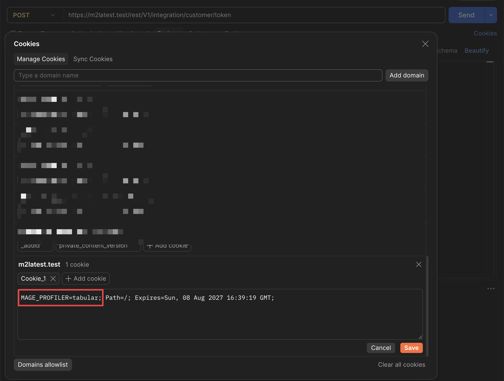

<div align="center">

# Mage-OS Profiler

</div>

<div align="center">

[](https://packagist.org/packages/mage-os/module-profiler)
[](https://github.com/mage-os-lab/module-profiler/actions/workflows/check-extension.yaml)


</div>

## Overview
**Mage-OS Profiler adds** a **`tabular`** and a **`json`** profiler output type to Magento 2 — a third and fourth option next to the built-in `html` and `csvfile`.

It profiles **all three request types from one switch**: storefront and admin **web** requests, **REST and GraphQL API** requests, and **CLI** commands. The last two stock Magento cannot profile at all — `html` writes into the response body, which is useless for JSON endpoints and impossible for a console command. On web requests this writes to a log file instead of appending a table to the page.

No core file is patched: activation happens in `bootstrap.php`, before the ObjectManager exists, which is the only moment early enough to catch the whole request.

```
[2026-08-04 02:07:35] pid=68 sapi=fpm-fcgi GET /rest/V1/directory/currency
Timers: 19 | Calls: 21 | Root time: 73.567 ms | Peak real: 11.96 MB | Peak emalloc: 10.66 MB
+-------------------------------------------------------+-----+-----------+----------+--------------+--------------+------+
| Timer Id                                              | Cnt | Time (ms) | Avg (ms) | Emalloc (KB) | RealMem (KB) | %    |
+-------------------------------------------------------+-----+-----------+----------+--------------+--------------+------+
| cache_frontend_create                                 | 2   | 3.772     | 1.886    | 20.43        | 0.00         | 5.1  |
| magento                                               | 1   | 69.795    | 69.795   | 4277.05      | 2048.00      | 94.9 |
| |- store.resolve                                      | 1   | 10.267    | 10.267   | 73.98        | 0.00         | 14.0 |
| |- locale/currency                                    | 2   | 2.638     | 1.319    | 22.00        | 0.00         | 3.6  |
| |  |- EVENT:currency_display_options_forming          | 1   | 1.100     | 1.100    | 19.13        | 0.00         | 1.5  |
| |  |  |- OBSERVER:magento_currencysymbol_currency...  | 1   | 1.021     | 1.021    | 9.77         | 0.00         | 1.4  |
| |- EVENT:controller_front_send_response_before        | 1   | 3.941     | 3.941    | 23.90        | 0.00         | 5.4  |
+-------------------------------------------------------+-----+-----------+----------+--------------+--------------+------+
```

> [!WARNING]
> **Development and staging use only — not for production.**
>
> Every profiled request pays instrumentation overhead on the DB adapter, search client,
> Redis commands and cache frontend. `var/log/profiler_tabular.log` appends forever and has
> no rotation of its own. With `MAGE_PROFILER_SQL=query`, bound values — customer emails,
> names, tokens — are written to disk unredacted.
>
> Profile a production issue on a staging copy. If a live run is unavoidable, scope it to a
> single CLI command or one cookie-gated session, then verify
> `bin/magento dev:profiler:status` reports the gate closed. See [Security](#security).

## Demo

`tabular` output on a CLI command:

<div align="center">


</div>

## Key Features
* Profiles **CLI commands** and **REST / GraphQL API** requests — neither of which stock Magento can profile at all
* Two output types that can run together: `tabular` (ASCII log) and `json` / `timeline` (structured per-run files)
* Captures aggregate rows **and** per-call spans, so a timeline is available without deciding before the run
* **SQL query profiling** on by default, with a per-table breakdown of every query
* **OpenSearch profiling** per operation and index, covering the reindex path the search adapter never sees
* Times DB, search, HTTP clients and the gateway transport, GraphQL resolvers, Web API, controller dispatch, indexers, mview, cron jobs, session handler, cache frontend, individual Redis commands, lock waits, image manipulation, mail sending, message queues and console commands
* **Per-job cron timing.** Core measures each job against a private stat object and writes it out as JSON; this surfaces it in the same report as everything the job did
* **Checkout arithmetic** — totals collection per collector, shipping rates per carrier, cart price rules per rule id: the place a real store's checkout time actually goes, and the one thing a wall of SQL rows never names
* Thresholds default to **zero** — core's `html` output hides everything under 1ms / 10 calls / 10KB, which drops most of an API request
* Filter noise by minimum duration or by PCRE on the timer id
* Log output is confined to `var/log/` and forced to a `.log` extension, so a report can never land somewhere web-served or executable
* Cookie activation is gated behind developer mode or a shared secret
* `Benchmark` helper for instrumenting your own code in a few lines

## Feature Highlights

### What Stock Magento Cannot Do

| Stock profiler | This extension |
|---|---|
| `html` appends a table to the response body — unusable for JSON endpoints | Writes to a log file or STDERR, never to the response |
| CLI commands cannot be profiled | `MAGE_PROFILER=tabular bin/magento <command>` prints the table after the run |
| REST / GraphQL cannot be profiled | Same switch, same table, per request |
| Thresholds hide anything under 1ms / 10 calls / 10KB | Thresholds default to zero; opt into filtering when you want it |
| No SQL visibility | Every query timed, grouped by operation and table |
| No structured output | One JSON file per run, with per-call spans |

### Output Types

Run either, or both together as `MAGE_PROFILER=tabular,json`:

| Type | Writes | Use |
|---|---|---|
| `tabular` | ASCII table appended to `var/log/profiler_tabular.log` | Reading in a terminal; STDERR on CLI |
| `json` (= `timeline`) | one structured file per run in `var/log/profiler/` | CI diffing, custom viewers, tooling |

`json` and `timeline` are two names for the same capture — aggregate `rows` **and** per-call `spans`. Set `MAGE_PROFILER_MAX_SPANS=0` for an aggregate-only file.

### Turning It On

Three ways, in order of scope:

```bash
# 1. one CLI command (Docker: -e goes before the container name)
MAGE_PROFILER=tabular bin/magento indexer:reindex catalog_product_price

# 2. one browser session or API client — cookie
#    MAGE_PROFILER=tabular   (developer mode, or tabular:<secret> otherwise)

# 3. everything, until switched off — flag file at var/profiler.flag
bin/magento dev:profiler:enable tabular
bin/magento dev:profiler:status
bin/magento dev:profiler:disable
```

For **REST / GraphQL requests from an API client** such as Postman, send the cookie as a plain request header:

```http
Cookie: MAGE_PROFILER=tabular
```

<div align="center">



</div>

The cookie is honoured only in **developer mode**. Anywhere else it must carry the shared secret — set `MAGE_PROFILER_SECRET` in the PHP environment and append it after the last output type:

```http
Cookie: MAGE_PROFILER=tabular:<secret>
Cookie: MAGE_PROFILER=tabular,json:<secret>
```

Store configuration cannot switch profiling on: activation happens during bootstrap, long before store config is readable. The admin settings control the **output** only.

### Every Request Type Gets A Root

Nesting is only useful if something sits at the top of it. Core opens one root timer, `magento`, for
web requests and nothing at all for the console, so a CLI profile used to be a flat list of unrelated
roots and a storefront profile had `magento` and then a thousand-row drop straight to individual
queries.

Each entry point now reports its own row, and everything else hangs underneath it:

```
CLI:indexer:reindex                             bin/magento, by command name
WEBAPI:GET /V1/products/:sku                    REST, by matched route template
GRAPHQL:query (getProducts)                     GraphQL, by operation name
CONTROLLER:checkout_index_index                 storefront and adminhtml, by full action name
```

`CONTROLLER:` is wired on `ActionInterface`, so it covers every controller — **including the ones core
does not time.** Core only times controllers extending the deprecated `Magento\Framework\App\Action\Action`
base class, which emits `CONTROLLER_ACTION:` from its own `dispatch()`. Anything implementing
`ActionInterface` directly — the modern majority, and every Hyvä controller — went through
`FrontController::processRequest`, which has no per-action timer at all.

Controllers that *do* extend the legacy base class are skipped deliberately, so core keeps them and
the same work is never reported twice under two names. A profile therefore shows `CONTROLLER:` or
`CONTROLLER_ACTION:` for a given page, never both.

There is no area flag for it. One timer per request is too cheap to be worth a switch, and it is the
row every other row hangs from.

### SQL Query Profiling

Every query is timed and grouped, so a slow reindex shows which tables it is spending its time in rather than one opaque total.

```bash
# which tables dominate a reindex?
MAGE_PROFILER=tabular MAGE_PROFILER_FILTER='/^SQL/' bin/magento indexer:reindex

# operation mix only, no per-table breakdown
MAGE_PROFILER=tabular MAGE_PROFILER_SQL=operation bin/magento indexer:reindex

# off, without touching the rest of the profiler
MAGE_PROFILER=tabular MAGE_PROFILER_SQL=0 bin/magento indexer:reindex
```

#### Capturing The Statement Itself

`MAGE_PROFILER_SQL=query` records the statement and its bind params onto every SQL span in the
`json` report, so a viewer can resolve a `SQL:` row back to the query behind it. Without it the
report tells you `SQL:SELECT (catalog_product_entity +3)` cost 157 ms but never which query that was.

```bash
MAGE_PROFILER=json MAGE_PROFILER_SQL=query bin/magento indexer:reindex
```

For a single storefront request, set it as a **second cookie** next to `MAGE_PROFILER` — area flags
are otherwise read from the environment only, which would turn capture on for every request the
container serves:

```
Cookie: MAGE_PROFILER=json
Cookie: MAGE_PROFILER_SQL=query
```

Cookie-supplied flags are honoured under exactly the gate that guards cookie activation itself:
developer mode, or a matching `MAGE_PROFILER_SECRET`. Activating by environment variable does not
open the door — otherwise a passing visitor could upgrade an operator's run to capture statements.

The modes are mutually exclusive. `operation` exists to shed detail and `query` to gather it, so
there is no `operation,query`; use `MAGE_PROFILER_MAX_DETAIL` if you want shorter ids while capturing.

| Variable | Default | Meaning |
|---|---|---|
| `MAGE_PROFILER_SQL_MAXLEN` | `1000` | Longest captured statement, cut at the tail with `...`. A storefront `SELECT` with a few joins is 400-900 bytes |
| `MAGE_PROFILER_SQL_BUDGET` | `1048576` | Total captured bytes per request. Once spent, later spans carry no statement and the CPU cost stops too |

`meta.sql_captured` in the report counts the spans that carried a statement, so a run that hit the
budget is distinguishable from one recorded with capture off.

Two things worth knowing before turning it on:

* **Pair it with a shorter retention.** 1 MiB per report against the default `MAGE_PROFILER_KEEP=100`
  is ~130 MB in `var/log/profiler`. `MAGE_PROFILER_KEEP=10` is a sensible companion.
* **`MAGE_PROFILER_MAX_SPANS=0` captures nothing**, because the statement lives on the span. The
  reverse is a nice property though: once the per-prefix id cap collapses ids into `SQL:<overflow>`,
  the aggregate row is useless but the per-span statement is not.

`full` is reserved for a later release: the same capture plus the call stack that issued the query.

### Search Engine Profiling

Two layers. `SEARCH:` times the search adapter, so a storefront request shows which container was queried. `OPENSEARCH:` times the OpenSearch client underneath it — which index, which operation, how big the indexing batches were. The write path never goes through the adapter, so without the second layer a `catalogsearch_fulltext` reindex looks like pure SQL:

```
CLI:indexer:reindex
 |- INDEXER:catalogsearch_fulltext::reindexAll
     |- OPENSEARCH:indexExists (magento2_product_1_v*)
     |- OPENSEARCH:createIndex (magento2_product_1_v*)
     |- OPENSEARCH:addFieldsMapping (magento2_product_1_v*)
     |- OPENSEARCH:bulkQuery (magento2_product_1_v* x100)   Cnt 12
     |- OPENSEARCH:updateAlias (magento2_product_1)
     |- OPENSEARCH:deleteIndex (magento2_product_1_v*)

magento
 |- SEARCH:SearchAdapter\Adapter (quick_search_container)
     |- OPENSEARCH:query (magento2_product_1)
```

Reads report the alias; writes target a physical index whose version increments on every full reindex, so `magento2_product_1_v37` is folded to `magento2_product_1_v*` — otherwise each run would add a permanent new row and eat into the per-prefix id cap. Bulk batches carry their size snapped to a power of ten (`x100`, `x1k`), which keeps the id count small while making batch cost readable straight off the Cnt / Time / Avg columns. A response that timed out, lost a shard, or reported bulk errors opens a nested zero-duration `OPENSEARCH:query:degraded` / `OPENSEARCH:bulkQuery:errors` marker, whose Cnt is the failure count.

```bash
# what does a catalogsearch reindex actually spend its time on?
MAGE_PROFILER=tabular MAGE_PROFILER_FILTER='/SEARCH/' bin/magento indexer:reindex catalogsearch_fulltext

# operations only, no index names
MAGE_PROFILER=tabular MAGE_PROFILER_SEARCH=operation bin/magento indexer:reindex

# both search layers off
MAGE_PROFILER=tabular MAGE_PROFILER_SEARCH=0 bin/magento indexer:reindex
```

### Cache And Redis Profiling

Cache rows are named after the backend doing the work — `REDIS:load`, `FILE:save`, `DATABASE:clean` — so a profile says which store the time went to without a second column. Those rows are on by default.

The Redis client itself can be instrumented as well, giving every command its own row. **That is opt-in — `MAGE_PROFILER_REDIS=1`.** Wire commands nest inside the cache operation that issued them, so leaving them on by default meant every report carried a second, finer copy of what the rows above them already said, and a cache-cold page turned into hundreds of extra spans. Ask for them when the question is specifically *what is this frontend call doing on the wire*:

```
REDIS:save (ADMINHTML)              Cnt  32   132.206 ms
 |- REDIS:MGET (ADMINHTML)          Cnt  32     1.133 ms
 |- REDIS:MULTI                     Cnt  15     0.031 ms
 |- REDIS:SETEX (ADMINHTML)         Cnt   4     0.427 ms
 |- REDIS:SADD (CACHE_ALL_IDS)      Cnt  71     0.068 ms
 |- REDIS:EXEC                      Cnt  15     0.398 ms
REDIS:load (CUSTOM_BLOCK)           Cnt  19     0.948 ms
 |- REDIS:MGET (CUSTOM_BLOCK)       Cnt  19     0.571 ms
```

The parenthesised part is the **key family**, not the key: `CUSTOM_BLOCK_0D87A5…` becomes `CUSTOM_BLOCK`, `CAT_P_828` becomes `CAT_P`, a bare hash becomes `<hash>`, and a multi-key command adds a count — `MGET (CAT_P +4)`. Leading tokens are kept until the first entity id or hash, three at most.

That reduction is not decoration. Magento's cache ids are per-entity, so putting them in a timer id would give one row per product and per block on a single page — a report nobody can read, a per-prefix cardinality cap exhausted in one request, and customer- and URL-derived identifiers written into a log file that outlives it. The family answers the question you actually have (*which kind of key is costing me*) and stays at a few dozen values.

When you are chasing one specific key, `MAGE_PROFILER_REDIS=keys` puts the whole id back — `REDIS:load (global|primary|plugin-list)` — with all the cardinality and disclosure that implies. Pair it with `MAGE_PROFILER_FILTER` and treat the log as sensitive.

**Operations are lowercase, commands uppercase**, and commands nest under the operation that issued them. That split answers the question the frontend row alone cannot: in the run above, 132ms of `save` contains under 3ms of actual Redis traffic — the rest is serialization and tag bookkeeping in PHP, which is a very different fix from "Redis is slow".

Tag traffic (`SADD`, `SREM`, `SUNION`, `SINTER`) is included, and some of it fires outside any `load`/`save` window — deferred writes are committed on shutdown — so a few command rows legitimately have no cache-operation parent.

`MAGE_PROFILER_REDIS` is unset by default, which means off. `1`, `on`, `true`, `yes` or `keys` turn the command rows on; `MAGE_PROFILER_CACHE=0` drops the frontend rows as well.

#### What Was On The Wire

With the command rows on, each one also carries the command it ran, recorded on the span exactly as a captured SQL statement is:

```
REDIS:MGET (BLOCK)          MGET 69d_:BLOCK_9a8b7c 69d_:BLOCK_1f2e3d
REDIS:SADD (CACHE_ALL_IDS)  SADD cache:all_ids GLOBAL__RESOURCESCACHE
REDIS:SETEX (BLOCK)         SETEX 69d_:BLOCK_9a8b7c 7200
                            └ value: <igbinary 668.9 KB>
```

Keys and set members are written in full — they are identifiers, and they are the answer to *which* keys a command touched, which the key family in the timer id deliberately drops. Value arguments are separated out and bounded: readable payloads are cut at 96 characters, and a serialized or compressed one is reported by encoding and size rather than content, because Magento's Redis backend serializes and compresses above `compress_threshold` and a raw payload in a log file is unreadable at best and a terminal escape sequence at worst.

The command line is only assembled when a `json` / `timeline` run is recording — a `tabular` run has no column for it and pays nothing. A command line is capped at 2 KB, arguments at 24, and the whole request at 256 KB, after which capture stops.

Treat a report recorded this way as sensitive: the values are fragments of whatever is in the cache, and the cache holds rendered blocks. See [Security](#security).

One core quirk worth knowing, because it is visible in every 2.4.9 profile: `App\Cache\Frontend\Factory` applies its decorator list **twice** — once inside `createSymfonyCache()` (`Factory.php:595`) and again in `create()` (`:196`) — so every configured cache decorator is built wrapping itself. Magento's own `Decorator\Profiler` shows the symptom as `cache_load` nested inside `cache_load`. This module detects the duplicate and makes the outer instance a pass-through, so cache operations are reported once, by the instance closest to the backend.

Two things to know before reading the numbers:

* **Time overlaps between the layers.** `REDIS:MGET` runs *inside* `REDIS:load`, so the same milliseconds appear in both rows and the `%` column can sum past 100. That is ordinary inclusive-time behaviour — the per-span self time in the `json` report is what separates them.
* **Volume.** A cache-cold page can issue hundreds of commands, and each one is a span. With the default `MAGE_PROFILER_MAX_SPANS=5000` a Redis-heavy request will hit the cap and the Timeline will truncate; raise the cap, or simply leave `MAGE_PROFILER_REDIS` unset when you are profiling something else. This is the reason the area is opt-in.

Only the **cache** client is instrumented. Session Redis traffic goes through a Credis client that Magento constructs with no injection point of any kind, so it stays behind the single `SESSION:read` / `SESSION:write` timers.

### The Quiet Costs

Subsystems that spend real time and report none of it anywhere you would look.

```
HTTP:POST (gateway.example.com)     1    842.106 ms   <- payment gateway, via the Zend transport
LOCK:lock (CUSTOM_BLOCK)            2      3.506 ms   <- queued behind another process
FPC:load                            1      8.916 ms
 |- FPC:load:miss                   1      0.007 ms   <- Cnt is the hit/miss count
IMAGE:open (Gd2)                    1     80.448 ms
IMAGE:resize (Gd2)                  1     14.218 ms
MAIL:send (Model\Transport)         1    311.400 ms   <- inside the request that placed the order
QUEUE:publish (product_action_attribute.update)
QUEUE:consume (Consumer)

CLI:cron:run                        1   1145.267 ms
 |- CRON:catalog_index_refresh_price      1      4.796 ms
 |- CRON:sales_clean_orders               1      8.392 ms   <- 29 jobs, not one opaque row
```

| Area | What it covers | Env |
|---|---|---|
| `HTTP:` | Every outbound path: `HTTP\ClientInterface` (curl **and** socket, plus third-party clients implementing it), `AsyncClientInterface`, `HTTP\Adapter\Curl`, and `LaminasClient::send()` — the last is what **PayPal Payflow, USPS, DHL and the currency imports** actually use, and it reaches neither of the other two, so the slowest call in a checkout used to be invisible | `MAGE_PROFILER_HTTP` |
| `LOCK:` | `LockManagerInterface`. A lock wait is dead time: no query, no cache call, just a request queued behind another process — the usual reason a page is fast alone and slow under load | `MAGE_PROFILER_LOCK` |
| `FPC:` | Magento's built-in full page cache, with the hit or miss recorded as a nested marker. Silent behind Varnish, which is itself worth knowing | `MAGE_PROFILER_FPC` |
| `IMAGE:` | GD / ImageMagick work. The first uncached view of a category page generates every thumbnail it shows | `MAGE_PROFILER_IMAGE` |
| `MAIL:` | `TransportInterface::sendMessage`. Transactional mail is sent synchronously, so a slow relay is charged to the customer | `MAGE_PROFILER_MAIL` |
| `QUEUE:` | Publishing and consuming. Consumers are long-running CLI processes — the workload most worth profiling, and the one whose SQL previously had nothing to attribute it to | `MAGE_PROFILER_QUEUE` |
| `CRON:` | Each cron job separately. Core does time them — against a private `Stat` that it JSON-logs and never routes through `\Magento\Framework\Profiler`, so `cron:run` otherwise profiles as one opaque row with an entire run hidden inside it | `MAGE_PROFILER_CLI` |

Details stay bounded the same way everywhere: hosts without query strings, adapters rather than file paths, transports rather than recipients, and lock names through the cache-key family reduction — Magento locks per cache entry and per price context, so the raw names are per-entity.

### Checkout Arithmetic

The first area here that instruments Magento's own application rather than the infrastructure under
it. Everything else times something Magento *talks to* — a database, a cache, a search engine, an HTTP
endpoint. This times what checkout does with the answers, which on a real store is where the time goes.

```
TOTALS:collectAddressTotals              1    412.663 ms
 |- TOTALS:Quote\Subtotal                 1      8.104 ms
 |- TOTALS:Quote\Shipping                 1    311.229 ms
 |   |- SHIPPING:collectRates             1    309.870 ms
 |       |- SHIPPING:collectCarrierRates (ups)        1   298.114 ms   <- one carrier, most of the checkout
 |       |- SHIPPING:collectCarrierRates (flatrate)   1     2.947 ms
 |       |- SHIPPING:collectCarrierRates (tablerate)  1     2.951 ms
 |- TOTALS:Quote\Discount                 1     71.402 ms
 |   |- RULE:process (12)                24     58.113 ms   <- 24 = rules x items
 |   |- RULE:process (3)                 24      9.556 ms
 |- TOTALS:Quote\Weee                     1      0.284 ms
```

Three reasons this is worth its own area:

* **Totals collection runs on every quote change** — every qty edit, every address change, every
  coupon attempt — and collectors run in sequence from `sales.xml`, so one slow third-party collector
  is charged to a page that looks like it is doing nothing. The per-collector row names it.
* **A live carrier is an HTTP call inside the request, while the customer waits.** `HTTP:` already
  reports that call, but by *host* — and a rate aggregator answers for several carriers on one host.
  The carrier code is what tells you which one to switch off.
* **Rule evaluation is rules × items.** A store that has accumulated forty rules over a few years pays
  for all forty on every totals collection. The rule id in the detail is what lets one row be traced
  back to one row in the admin grid; rule *names* are admin-entered free text and never reach the id.

Switch the whole area off with `MAGE_PROFILER_CHECKOUT=0`.

Totals are hooked at two levels, and the per-collector plugin is wired on
`Quote\Address\Total\CollectorInterface` rather than on `AbstractTotal`: a collector is only required
to implement the interface, and the ones that skip the abstract class are third-party — exactly the
ones worth timing.

### Timeline

The `json` output writes one file per run into `var/log/profiler/`, indexed by `index.jsonl` so a run picker can be built without opening every report.

Each report holds both the aggregate `rows` a `tabular` report shows and the per-call `spans` behind them — every call's start offset, duration and nesting depth. That is enough to reconstruct a flame chart or diff two runs, and the index means tooling can list runs without parsing any of them. `MAGE_PROFILER_MAX_SPANS=0` writes an aggregate-only file when the span detail is not wanted.

```json
{"ts":"2026-08-04T02:07:35+00:00","sapi":"fpm-fcgi","request":"GET /rest/V1/directory/currency",
 "rows":[{"id":"magento","count":1,"time":0.069795,"avg":0.069795}],
 "spans":[{"id":"magento","start":0.0,"time":0.069795,"depth":0}]}
```

### Instrument Your Own Code

```php
use MageOS\Profiler\Util\Benchmark;

Benchmark::start('my.expensive.thing');
// ...
Benchmark::stop('my.expensive.thing');
```

Timers nest automatically and appear in both outputs alongside the framework's own.

## 🛠️ Installation

### 1 Using Composer (Preferred)
```
composer require mage-os/module-profiler
```

### 2 Using Modman
```
modman init
modman clone git@github.com:mage-os-lab/module-profiler.git
```

### 3 Using Zip File
* Download the [Extension Zip File](https://github.com/mage-os-lab/module-profiler/archive/main.zip)
* Extract & upload the module files to `/path/to/magento2/app/code/MageOS/Profiler/`

After installation by either means, activate the extension with following steps

1. Enable the module
```
php bin/magento module:enable MageOS_Profiler --clear-static-content
php bin/magento setup:upgrade
```
2. Flush the store cache
```
php bin/magento cache:flush
```
3. Deploy static content - *in Production mode only*
```
rm -rf pub/static/* var/view_preprocessed/*
php bin/magento setup:static-content:deploy
```
4. Profile something
```
MAGE_PROFILER=tabular php bin/magento cache:clean
tail -f var/log/profiler_tabular.log
```

The extension creates no tables of its own.

## Configuration

**Stores > Configuration > Advanced > Developer > Profiler Settings**

These control the **output** only — they cannot switch profiling on. Environment variables win over admin config.

Magento hides the whole *Developer* section in production mode, so in production these are reachable only through the environment variables below or `bin/magento config:set dev/profiler/<field>`.

| Setting | Env override | Default |
|---|---|---|
| Write Output | — | Yes |
| Log File Path (relative to Magento root) | `MAGE_PROFILER_LOG` | `var/log/profiler_tabular.log` |
| Minimum Timer Duration (ms) | `MAGE_PROFILER_MIN_MS` | `0` — show everything |
| Timer Id Filter (PCRE) | `MAGE_PROFILER_FILTER` | none |
| Print To STDERR On CLI | `MAGE_PROFILER_CLI_STDERR` | Yes |

Instrumentation itself is environment-only: `MAGE_PROFILER_SQL` (`0` off, `operation` for no table names, `query` to capture the statement), `MAGE_PROFILER_REDIS` (**opt-in** — unset means off; `1` for wire commands and their captured command line, `keys` to also put the raw key in the id), `MAGE_PROFILER_LOCK`, `MAGE_PROFILER_FPC`, `MAGE_PROFILER_MAIL`, `MAGE_PROFILER_IMAGE`, `MAGE_PROFILER_QUEUE`, `MAGE_PROFILER_CHECKOUT`, `MAGE_PROFILER_SEARCH` (`0` off, `operation` for no index names), `MAGE_PROFILER_SQL_MAXLEN`, `MAGE_PROFILER_SQL_BUDGET`, `MAGE_PROFILER_MAX_DETAIL`, `MAGE_PROFILER_MAX_IDS`, `MAGE_PROFILER_MAX_SPANS`, `MAGE_PROFILER_REPORT_DIR`, `MAGE_PROFILER_KEEP_DAYS`, `MAGE_PROFILER_KEEP_QUERY`.

## Security

This extension is intended for development and staging environments. The gates below exist to
contain the damage of a production run, not to make one safe.

`MAGE_PROFILER_REDIS=1` writes the **command line of every Redis command**, keys and set members
included, and a bounded fragment of each value argument. The cache holds rendered blocks, so those
fragments can carry customer names, addresses and cart contents. Serialized and compressed payloads
are reported by encoding and size rather than content, which on a stock install is most of them - but
that is a property of how Magento stores the data, not a redaction, and it does not hold for a store
with compression off. The area is off unless asked for, and the same handling applies as below.

`MAGE_PROFILER_SQL=query` writes the statement **and its bound values** into the report. Those values
routinely include customer data - email addresses, names, tokens. No redaction is attempted, because
positional binds carry no column name and any heuristic would be theatre. Treat a report recorded
with capture on exactly as you would treat a query log: it is off by default, and `var/log/profiler`
should not be world-readable.

Cookie activation lets an unauthenticated visitor make the server write to disk and expose internal timing. It is therefore honoured **only** when:

* `MAGE_MODE` is `developer`, **or**
* the cookie carries the shared secret — `MAGE_PROFILER=tabular:<secret>` matching the `MAGE_PROFILER_SECRET` environment variable (compared with `hash_equals`)

Otherwise the cookie is ignored outright. `MAGE_PROFILER` env-var and `var/profiler.flag` activation are ungated — both already require server-side access.

The report path is **always confined to `var/log/`** and always written with a `.log` extension: traversal segments are dropped and anything outside is folded back in, so a mistyped or hostile path cannot put the report somewhere web-served or executable. Request query strings are stripped from the report label by default, since API calls routinely carry tokens in them (`MAGE_PROFILER_KEEP_QUERY=1` to keep them).

### Production checklist

If the profiler is installed on a production store, it should be dormant. Before and after any
live run:

* Leave `MAGE_PROFILER_SECRET` unset unless actively profiling — an unset secret means the
  cookie is ignored outright outside developer mode.
* Never leave `var/profiler.flag` behind. It arms *every* request until removed.
* Keep `MAGE_PROFILER_SQL` off, or at `operation`. Only `query` writes bound values to disk.
* Rotate `var/log/profiler_tabular.log` — it appends forever and has no rotation of its own.
  An unattended flag file plus no rotation will fill the disk.
* Remember that instrumentation is not free: the DB adapter, search client, Redis commands and
  cache frontend are all wrapped while profiling is armed.
* Verify with `bin/magento dev:profiler:status`, which prints the current gate state.

## Developer Notes

### Activation runs before the ObjectManager

`bootstrap.php` is included by Composer's `files` autoload, which is why it can arm the profiler before Magento starts. That file therefore cannot use DI, the request abstractions or the store config — superglobals and filesystem functions are the only option, and the sniff exclusions in it are deliberate.

### What gets instrumented

Plugins wrap `Magento\Framework\DB\Adapter\Pdo\Mysql`, `Magento\Framework\Search\AdapterInterface`, `Magento\OpenSearch\Model\SearchClient`, `Magento\Framework\HTTP\Client\Curl`, `Magento\Framework\HTTP\AsyncClientInterface`, the GraphQL query processor and resolvers, the Web API request and output processors, `Magento\Framework\App\ActionInterface`, `Magento\Quote\Model\Quote\TotalsCollector`, `Magento\Quote\Model\Quote\Address\Total\CollectorInterface`, `Magento\Shipping\Model\Shipping`, `Magento\SalesRule\Model\Validator`, `Magento\Indexer\Model\Indexer`, `Magento\Framework\Mview\ActionInterface`, `Magento\Framework\Session\SaveHandler`, `Magento\Framework\Profiler\Driver\Standard\Stat`, `Magento\Framework\App\Cache\Frontend\Factory` and `Symfony\Component\Console\Command\Command`.

Two of those need a word of explanation.

`ActionInterface` is wrapped on the interface, so every controller is timed as
`CONTROLLER:<full action name>`. Controllers still extending the deprecated
`Magento\Framework\App\Action\Action` base class are skipped deliberately: core already times
those itself as `CONTROLLER_ACTION:`, and wrapping both would report the same work twice under two
names.

`Stat` is not instrumentation of the profiler - it is how cron timings are recovered.
`Cron\Observer\ProcessCronQueueObserver` measures every job against its own `Stat` instance and
writes the result out as JSON, so none of it reaches `\Magento\Framework\Profiler`. The plugin
mirrors those `job <code>` timers in as `CRON:<code>`. Note that it therefore fires for *every*
timer this module records, its own included; a `strncmp` against cron's prefix is what keeps that
cheap and what stops the mirroring recursing.

### Static analysis

```bash
# standalone, from this package's checkout — the same thing CI runs
composer update
vendor/bin/phpstan analyse
vendor/bin/phpunit -c phpunit.xml.dist

# or against an install, from the Magento root
vendor/bin/phpcs --standard=Magento2 app/code/MageOS/Profiler/
vendor/bin/phpunit -c dev/tests/unit/phpunit.xml.dist app/code/MageOS/Profiler/Test/Unit
```

Unit tests live in `Test/Unit` and cover the tabular renderer, the timer id builder, the SQL plugin, the OpenSearch client plugin and the benchmark helper.

## Authors
- Raj KB — original author, who contributed this module to Mage-OS.

## To Contribute
Any contribution to the development of `Mage-OS Profiler` is highly welcome.
The best possibility to provide any code is to open a [pull request on GitHub](https://github.com/mage-os-lab/module-profiler/pulls).

## Need Support?
If you encounter any problems or bugs, please create an issue on [GitHub](https://github.com/mage-os-lab/module-profiler/issues).

## License
Dual-licensed under the [Open Software License 3.0](LICENSE.txt) and the [Academic Free License 3.0](LICENSE_AFL.txt), matching Mage-OS and Magento Open Source.
